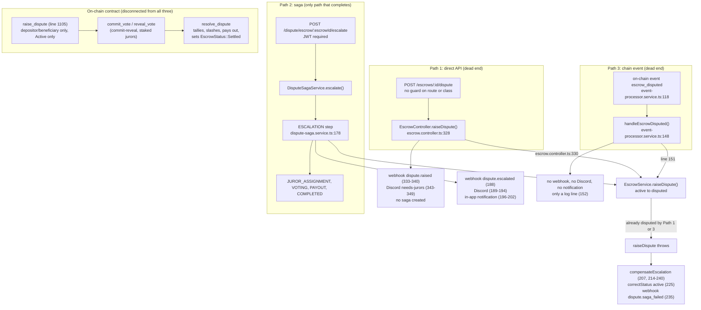

# Spike #464: Unifying the dispute entry points

## Summary

- Three paths can put an escrow into `disputed`: `POST /escrows/:id/dispute`,
  the saga route `POST /dispute/escrow/:escrowId/escalate`, and the
  `escrow_disputed` chain event. All three call `EscrowService.raiseDispute()`,
  but only the saga continues to jurors, votes and payout.
- The paths also differ in who may call them, which events they send and which
  notifications go out. Path 1 needs no login, and Path 2 needs one but does not
  record who raised the dispute.
- **Recommendation: option (a).** The saga becomes the single entry point. The
  API route and the chain-event handler both delegate to
  `DisputeSagaService.escalate()`.
- The saga verdict is the source of truth for now. Connecting it to the
  contract's `resolve_dispute` is deferred to the write-path spike (#180).
- Keep `dispute.raised` as the one public event, sent once from the saga.
- Nine follow-up issues are listed in section 9.

## Source

Line numbers refer to commit `e66237b911d14670cd2db9d3628bb22d0df5eb14` of
`trustflow-protocol/trustflow-backend`. File paths are under `backend/src/`.
The links open each file at that commit:

- [escrow/escrow.controller.ts](https://github.com/trustflow-protocol/trustflow-backend/blob/e66237b911d14670cd2db9d3628bb22d0df5eb14/backend/src/escrow/escrow.controller.ts)
- [escrow/escrow.service.ts](https://github.com/trustflow-protocol/trustflow-backend/blob/e66237b911d14670cd2db9d3628bb22d0df5eb14/backend/src/escrow/escrow.service.ts)
- [dispute/dispute-saga.service.ts](https://github.com/trustflow-protocol/trustflow-backend/blob/e66237b911d14670cd2db9d3628bb22d0df5eb14/backend/src/dispute/dispute-saga.service.ts)
- [dispute/dispute-saga.controller.ts](https://github.com/trustflow-protocol/trustflow-backend/blob/e66237b911d14670cd2db9d3628bb22d0df5eb14/backend/src/dispute/dispute-saga.controller.ts)
- [event-ingestion/event-processor.service.ts](https://github.com/trustflow-protocol/trustflow-backend/blob/e66237b911d14670cd2db9d3628bb22d0df5eb14/backend/src/event-ingestion/event-processor.service.ts)

Contract line numbers refer to commit `ca046cb` of
`trustflow-protocol/trustflow-contract`, file `contracts/trustflow/src/lib.rs`
(3,870 lines, no smaller `dispute.rs` split — everything lives in one file).

Line numbers will drift on newer commits, so re-check them before working on a
follow-up.

## 1. Current state: mapped flows

Three off-chain paths can put an escrow into `disputed`. All three end up
calling `EscrowService.raiseDispute()`, but only the saga does anything with
the result. The other two leave the escrow `disputed` with no way to assign
jurors, vote or pay out.

Separately, the on-chain contract
(`trustflow-protocol/trustflow-contract`, `contracts/trustflow/src/lib.rs`,
commit `ca046cb`) has its own, complete dispute lifecycle that the backend
does not call into at all:

- `raise_dispute` (line 1105) — requires the caller to be the escrow's
  depositor or beneficiary (`require_auth()` plus an explicit check),
  requires the escrow to be `Active`, and computes a `commit_deadline` and
  `reveal_deadline`.
- `commit_vote` / `reveal_vote` — a two-step commit-reveal scheme, not the
  single `cast_vote` the issue description names. A juror first submits a
  hash of their vote, then later reveals the actual vote; this prevents
  jurors from copying each other's votes.
- `resolve_dispute` — tallies revealed votes, **slashes** the stake of
  jurors who voted against the majority, transfers the disputed funds
  itself, and sets the escrow to `EscrowStatus::Settled` — a status that
  does not exist in the backend's `EscrowStatus` type
  (`'pending' | 'active' | 'released' | 'disputed' | 'cancelled'`, per
  `docs/state-model.md`).

This on-chain path is entirely disconnected from the three off-chain paths
below: nothing in the backend calls `raise_dispute`, `commit_vote`,
`reveal_vote` or `resolve_dispute`, and nothing in the contract knows the
saga exists.

**Who can trigger each path today**

| Path | Auth | Evidence |
|---|---|---|
| `POST /escrows/:id/dispute` | None (rate limit only) | `@Post(':id/dispute')` at line 289 has no `@UseGuards`, `@Idempotent` or `@Throttle`; the class (lines 40-42) has no guard either, and `escrow.controller.ts` does not use `JwtAuthGuard` anywhere. The only global guard is the rate limiter (`rate-limit.guard.ts`, registered as `APP_GUARD` in `rate-limit.module.ts`). |
| `POST /dispute/escrow/:escrowId/escalate` | JWT | `dispute-saga.controller.ts` applies `@UseGuards(JwtAuthGuard)` at class level (line 25), so every `/dispute` route requires a login. The route (lines 57-72) passes only `escrowId` and the body DTO to the service, never the authenticated user, so the token proves someone is logged in but does not identify who raised the dispute. The contents of `EscalateDisputeDto` were not checked (#445). |
| `escrow_disputed` chain event | n/a | Backend-internal. Payload decoding is the subject of #463. |

Neither API path records who raised the dispute from an authenticated
identity. Path 1 takes only the escrow id and a `reason` (lines 305-309, 328).
Path 2 authenticates the caller but never passes the user to the service
(`dispute-saga.controller.ts:70-71`).

## 2. Verified differences between Path 1 and Path 2

| | Path 1 (controller) | Path 2 (saga) |
|---|---|---|
| Creates a saga | No | Yes (`createSaga`, line 186) |
| Webhook event | `WebhookEvent.DisputeRaised` (333-340) | `dispute.escalated` (188; constant at line 30) |
| Webhook payload | escrowId, depositor, beneficiary, amountXLM, reason, disputedAt | `{ sagaId, escrowId }` only |
| Discord "needs jurors" | Yes (343-349) | Yes (189-194) |
| In-app notification | No | Yes (196-202) |

Consequences:
- A dispute raised through Path 1 sends a Discord message asking jurors to
  step in, but there is no endpoint that can ever assign them.
- The Swagger text for Path 1 (line 293) says it alerts jurors, which
  suggests a workflow that does not exist for this path.
- If both paths run for the same escrow, Discord is notified twice.

Path 3 differs from both. `handleEscrowDisputed()` (`event-processor.service.ts`,
lines 148-153) reads the escrow id from `event.topic[1]` and the reason from
`event.value.reason`, calls `raiseDispute()` at line 151, and logs. It sends
no webhook, no Discord message and no notification, so a dispute that starts
on-chain is silent to jurors and to webhook consumers. Using `topic[1]` as the
off-chain escrow id is also questioned in `docs/state-model.md` (it may be the
contract id), which was not checked here.

## 3. The race behind #390, traced through the code

1. Path 1 sets the escrow to `disputed`.
2. `escalate()` reaches line 178 and calls `raiseDispute()`, which rejects
   an already-disputed escrow (`escrow.service.ts:340`; the controller's Swagger documents a 400
   for it at line 326).
3. The `catch` at line 207 calls `compensateEscalation()`.
4. Lines 223-226 read the escrow and, because its status is `disputed`,
   call `escrowService.correctStatus(..., { status: 'active' })`. The
   compensation does not check whether this saga was the one that disputed
   it.
5. The legitimate dispute from step 1 is reverted to `active`. Line 235 then
   sends `dispute.saga_failed`, so outside systems see `dispute.raised`
   followed by `dispute.saga_failed` for an escrow that is no longer
   disputed.

A second window exists inside `escalate()` itself: `raiseDispute()` runs at
line 178 but the saga is only saved at line 186. Between those lines the
escrow is `disputed` and no saga exists.

Note: `docs/state-model.md` says the compensation writes `escrow.status`
inline. The code now uses `correctStatus()` (line 225), so that "known
deviation" is stale. The behaviour is the same.

The guard itself is also racy. `raiseDispute()` (`escrow.service.ts`, lines
336-348) reads the escrow, checks for `released` (339) and `disputed` (340),
then writes at line 346. Nothing in the function locks or versions the record
between the read and the write, so two calls arriving together can both pass
the check. `persist()` wraps only the write in a Redis transaction (354-357).
`correctStatus()` (256-264) then overwrites the status with whatever it is
given, with no guard, as its own comment says (lines 250-254).

## 4. Options evaluated

**Option (a), chosen: the saga becomes the single entry point.**
`POST /escrows/:id/dispute` stops calling `EscrowService.raiseDispute()`
and instead calls `DisputeSagaService.escalate()`. The chain-event handler
does the same. The escrow only moves to `disputed` as part of a saga
starting.

**Option (b): a chain `DisputeRaised` event is the only trigger, and the API
only builds an unsigned transaction.**
This follows a pattern that already exists: the controller imports
`EscrowReleaseTransactionBuilderService` (line 26) and returns
`buildRelease(...)` at line 283, so the backend prepares the transaction and
the wallet signs it. It is the better long-term direction, but it needs the
backend to decode real `DisputeRaised` events, which is still open in #463.

**Why (a) now:** it can be built today, it removes the #390 race instead of
deferring it, and it does not depend on #463 or #180. Option (b) stays on
the roadmap as a follow-up.

## 5. Saga verdict versus on-chain `resolve_dispute`

Off-chain today:
- `applyPayout()` (line 490) only calls `escrowService.release()` (493),
  `cancel()` (497) or `split()` (501). Nothing calls the contract.
- Both transaction hashes are placeholders. Escalation records
  `escalation-tx-${sagaId}` under the comment "Simulate on-chain escalation
  tx hash" (lines 180-181), and payout records `payout-tx-${sagaId}-${Date.now()}`
  (line 441).
- `split()` (`escrow.service.ts`, lines 327-334) sets the status to
  `released` without checking the current status. `release()` and `cancel()`
  were not checked.

The contract (section 1) has its own complete dispute lifecycle:
`raise_dispute`, `commit_vote`/`reveal_vote` (not a single `cast_vote` —
see section 1), and `resolve_dispute`, which tallies votes, slashes losing
jurors, and pays out on its own. Nothing in the backend calls any of these,
so the two systems are not connected and cannot yet disagree in practice —
but they easily could once someone does call them, because they disagree on
basic facts already:

- **Different verdict shapes.** The saga's verdict is one of three values,
  `BENEFICIARY_WINS` / `DEPOSITOR_WINS` / `SPLIT` (section on `applyPayout`
  above). The contract's ruling is a plain boolean,
  `ruling_for_depositor`, with no split option — `resolve_dispute` always
  pays the full remaining amount to one side.
- **Different escrow status on resolution.** The saga leaves the escrow
  `released` or `cancelled` (both values the backend's `EscrowStatus` type
  has). The contract sets `EscrowStatus::Settled`, a value the backend's
  type does not have at all (see section 1). If the reconciler
  (`applyChainState()`) ever read a resolved dispute from the chain, it
  would be asked to write a status the backend cannot represent.
- **Different voters.** The saga's jurors are assigned and vote through
  `POST /dispute/:sagaId/jurors` and `.../vote` — a list the backend
  controls. The contract's jurors are whoever holds a stake and calls
  `commit_vote`/`reveal_vote` directly against the chain — a list the
  backend does not control and, per the findings above, cannot currently
  even read.

**Recommendation:** treat the off-chain saga verdict as the source of truth
for now and do not wire `commit_vote`/`reveal_vote`/`resolve_dispute` into
this work. The proper link is for the `PAYOUT` step to build an unsigned
`resolve_dispute` transaction, like the release builder does — which would
also force a decision on reconciling the verdict shape (three-way vs.
boolean) and the missing `Settled` status. That belongs to the write-path
spike (#180). Until it lands, the fake transaction hashes should be
documented as placeholders so nobody treats them as chain references, and
the mismatched verdict/status shapes above should be called out explicitly
so #180 doesn't have to rediscover them.

**If the two ever disagree.** `EscrowService.applyChainState()`
(`escrow.service.ts`, lines 235-248) overwrites an escrow's status from
chain-verified state, and its comment says it exists so the reconciler can
correct off-chain drift once the chain is known to be ahead. So for the
escrow's *status*, the chain already wins over any off-chain result. Keep that
rule, and when the reconciler overrides a saga's outcome, mark the saga as
superseded instead of letting the escrow flip silently. In short: the saga is
the source of truth for the verdict while nothing resolves on-chain, and the
chain is the source of truth for escrow status whenever the two differ. This
only matters once something on-chain can resolve a dispute, which is not the
case yet because the backend never calls `resolve_dispute` — but see the
mismatched verdict and status shapes above, which #180 will have to resolve
before any such call can be made safely.

## 6. Escrows already `disputed` with no saga

An escrow that reached `disputed` through Path 1 or Path 3 cannot be adopted
today. Calling `escalate()` on it hits line 178, which (`escrow.service.ts:340`)
rejects an already-disputed escrow. The compensation then reverts
it to `active`. So trying to rescue an orphaned dispute currently un-disputes
it.

**Recommendation:** let `escalate()` accept an escrow that is already
`disputed`, skipping the `raiseDispute()` call in the `ESCALATION` step while
still creating the saga. Orphaned disputes can then be adopted after the fix
ships without a separate migration. The existing rule that only one active
saga may exist per escrow (documented as a 409 at
`dispute-saga.controller.ts:69`) still applies, and
`GET /dispute/escrow/:escrowId` (line 46) already returns the active saga for an
escrow, which helps find disputed escrows that have none.

## 7. Events and notifications: keep or retire

- **Keep `dispute.raised` as the public event** (documented per #439). Fire it
  once, from the saga's `ESCALATION` step, with the fuller payload the
  controller sends today plus `sagaId`. If the saga sends its slimmer
  payload, existing webhook consumers lose fields.
- **Keep `dispute.escalated`** as the internal saga event.
- **Retire** the `dispute.raised` webhook and the Discord message in
  `EscrowController.raiseDispute()` (lines 333-349) once the route delegates
  to the saga.
- Path 1 currently skips the in-app notification that the saga sends. After
  consolidation every dispute gets it.

## 8. Authorization

Today anyone can call the Path 1 route, and it records no caller identity.
Recommendation: the aliased route uses the same `JwtAuthGuard` as `/dispute`, and the
initiator is taken from the authenticated wallet, not from the request body.
Only the escrow's depositor or beneficiary should be allowed to raise a
dispute. Coordinate with #445. The saga route has the same gap: it
authenticates the caller but never passes the user to `escalate()` (lines
70-71), so this needs changing on both routes.

The state guard is also looser than `docs/state-model.md` describes.
`raiseDispute()` rejects only `released` (line 339) and already-`disputed`
(line 340) escrows, so a `pending` or `cancelled` escrow can be disputed. The
doc lists `active` as the only source state.

## 9. Follow-up issues

1. **Make `POST /escrows/:id/dispute` an alias for `DisputeSagaService.escalate()`.**
   Require JWT, bind the initiator to the authenticated wallet, restrict to
   escrow parties, and only allow `active` escrows (today `pending` and
   `cancelled` are accepted). Pass the authenticated user through the saga route too
   (`dispute-saga.controller.ts:70-71`). Depends on the #390 fix.
2. **Make `escalate()` atomic.** Persist the saga before, or in the same
   transaction as, freezing the escrow (lines 178 and 186), so there is no
   window with a disputed escrow and no saga.
3. **Fix `compensateEscalation()` so it only reverts what this saga changed.**
   Do not flip a `disputed` escrow to `active` unless this saga's own
   `raiseDispute()` call succeeded, and restore the escrow's previous status
   instead of hard-coding `active` (line 225). The revert is documented as
   intended in the route's Swagger (`dispute-saga.controller.ts:62-63`), so
   narrow it rather than remove it.
4. **Let `escalate()` adopt an already-disputed escrow.** Skip
   `raiseDispute()` in that case so orphaned disputes get a saga.
5. **Consolidate notifications.** One `dispute.raised` webhook with the full
   payload plus `sagaId`, one Discord message, one in-app notification, all
   sent from the saga. Remove the duplicates from `EscrowController`.
6. **Route `EventProcessorService.handleEscrowDisputed()` through
   `escalate()`.** Blocked on #463, because there is no reliable initiator in
   the chain event today. This also fixes chain-originated disputes sending
   no webhook, Discord or in-app notification at all.
7. **Tracked separately, blocked on #180:** make `executePayout()` build an
   unsigned `resolve_dispute` transaction instead of writing to the database,
   and replace the placeholder transaction hashes. This also has to resolve
   two mismatches found in section 5: the saga's three-way verdict versus the
   contract's boolean ruling, and the contract's `EscrowStatus::Settled`
   status, which the backend's `EscrowStatus` type does not have.
9. **Add `EscrowStatus::Settled` handling (or an equivalent) to the backend**
   before #180 can safely call `resolve_dispute`, since the contract can put
   an escrow into a status the backend cannot currently represent or store.
8. **Docs:** update `docs/state-model.md`, whose compensation description no
   longer matches the code and which gives the saga route as
   `/dispute/:escrowId/escalate` (the real route is
   `/dispute/escrow/:escrowId/escalate`).

## 10. Not yet verified

- Path 3 was checked in `event-processor.service.ts` (lines 118-119 and
  148-153). The claim that a duplicate chain event is recorded as a failed
  event comes from `docs/state-model.md` and was not checked.
- The contents of `EscalateDisputeDto` (`dispute.dto.ts`) were not checked,
  so whether the body carries an `initiator` field (#445) is unconfirmed.
- The service check behind the documented 409 for a second active saga was
  not read.
- `DisputeRaised` and `DisputeResolved` events, named in the issue
  description, were not found: `raise_dispute` and `resolve_dispute` were
  read directly (section 1) and neither publishes an event under those
  names. `commit_vote` and `reveal_vote` do publish events
  (`VoteCommitted`, `VoteRevealed`), and `resolve_dispute` publishes
  `JurorSlashed` for each slashed juror, but nothing marks the raising or
  resolving of a dispute itself with an event. This should be confirmed with
  a repo-wide search of `trustflow-contract` for `DisputeRaised` before
  relying on it, since it may exist under another name or in a different
  file.
- `EscrowRecord`, `DisputeRecord` and `DataKey` were read as used inside
  `raise_dispute`/`resolve_dispute`, not from their own type definitions, so
  their full shape is not confirmed.
- Whether anything other than the backend can call `raise_dispute`,
  `commit_vote`, `reveal_vote` or `resolve_dispute` directly (e.g. a wallet
  interacting with the contract without going through the backend at all)
  was not investigated.